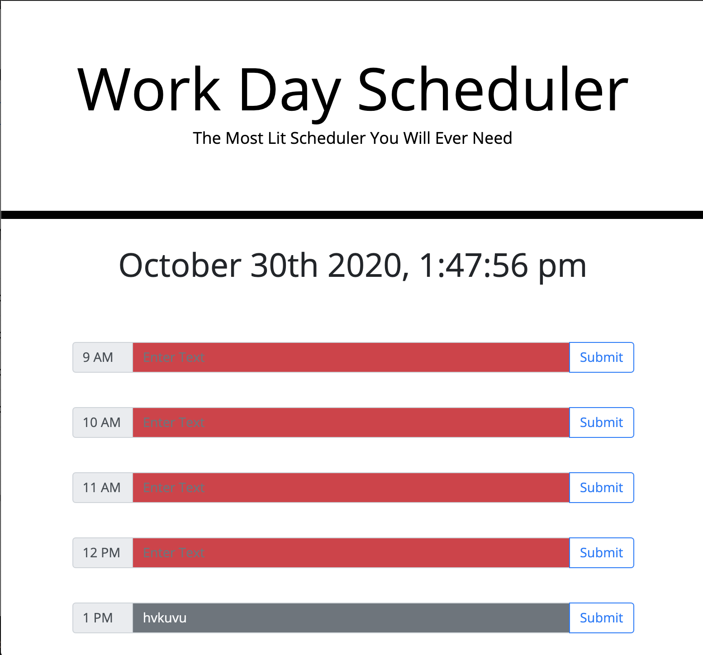
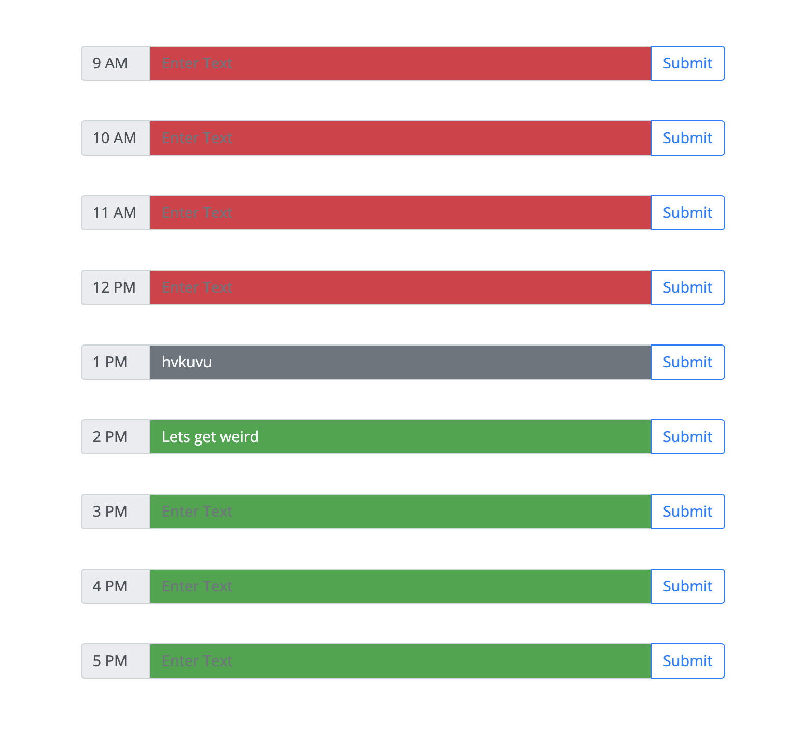

# 05 Third-Party APIs: Work Day Scheduler

## Completed Bullet Points

 * Work day scheduler with full functionality. 

 * 9am - 5pm Current Time attributes disabled/danger/success

 * Alternate sources added to better help with functionality

 * local storage connected and saves on submit

 * Added rows for each hour of the work day

 * Found an app breaking bug involving null

 * syntax errors are the main problem but they were resolved

